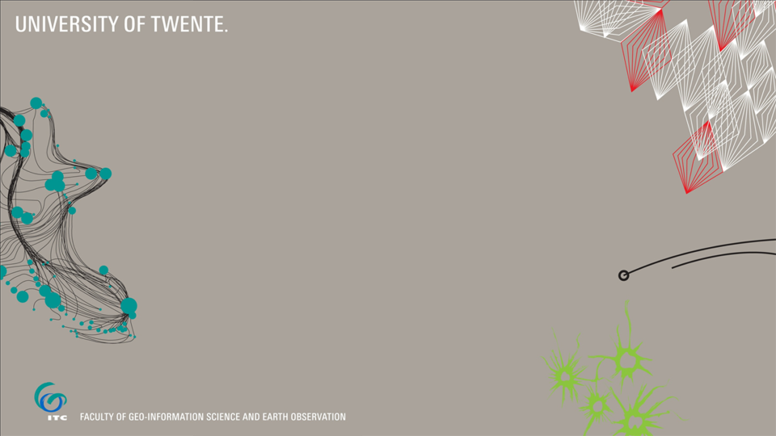

---?image=figures/PresentationCover.png&size=cover
@title[cover]
### @color[white](My first GitPitch presentation)
###### @color[white](R. Zurita-Milla)
###### @color[white](17 June 2018) 

---
### Numbered lists 
@title[lists]
1. element 1
2. element 2
3. element 3

---
### Two images 
@title[side by side, images]
@div[left-50]

@divend

@div[right-50]

@divend

Note: blabla notes presentor

---
### Fragments 
@title[framents]

@ul
- This is my first line
- this is my second line
@ulend

---
### Left and right content
@title[side by side]

    <ul>
        <li>Security (OWASP and more)</li>
        <li>‎Portmortems</li>
        <li>Game Day activities</li>
        <li>Chaos engineering</li>
    </ul>

---
@title[math]
##### A bit of maths 

The Cauchy-Schwarz Inequality

`\[
\left( \sum_{k=1}^n a_k b_k \right)^{\!\!2} \leq
 \left( \sum_{k=1}^n a_k^2 \right) \left( \sum_{k=1}^n b_k^2 \right)
\]`

+++
@title[Inline maths2]
##### In-line maths

This expression `\(\sqrt{3x-1}+(1+x)^2\)` is an example of an inline equation.

---?image=figures/That_s_all_folks.png&size=cover
@title[end]
  
  
  
  
@color[white](@fa[envelope] r.zurita-milla@utwente.nl)

